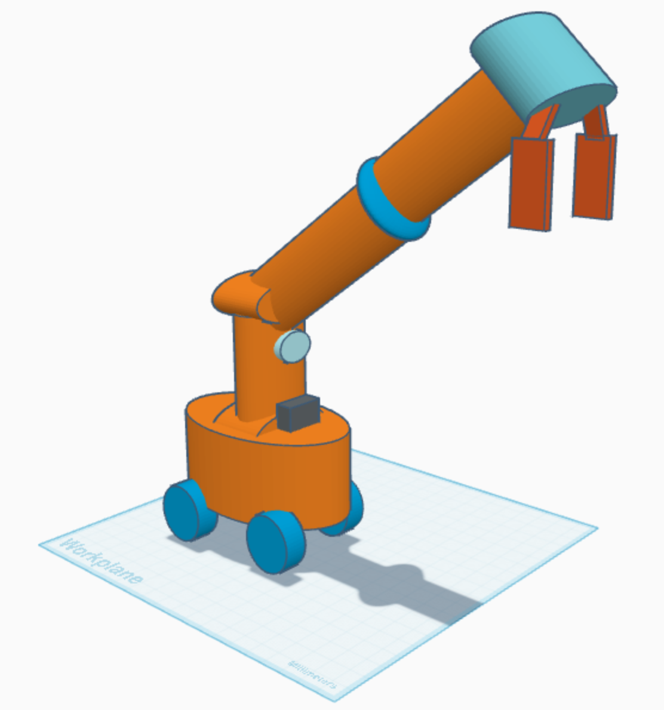

# 🤖 Warehouse Automation Robot

  

A robot designed to transform a food warehouse into a fully automated storage facility without human intervention.  
The robot is based on a mobile AGV/AMR platform with a robotic arm and integrated sensors to perform autonomous pick-and-place tasks.

---

## 📋 Execution Algorithm

1. ⚡ **Initialization**  
   - Power on the system and check sensors and battery.  
   - Connect to the Warehouse Management System (WMS).  

2. 📥 **Order Reception**  
   - Receive storage or retrieval requests from WMS.  
   - Identify the target item and its location.  

3. 🧭 **Navigation**  
   - Use 🔵 LIDAR to generate a real-time map.  
   - Use 📷 camera to detect markers/QR codes.  
   - Avoid 🚧 obstacles while moving.  

4. ✋ **Pick Operation**  
   - Main camera identifies the item.  
   - Gripper camera/sensor aligns and confirms grip.  
   - 🤲 Gripper closes to hold the box.  

5. 🚚 **Transport**  
   - Follow the computed path to the destination.  
   - Ensure collision-free navigation.  

6. 📦 **Place Operation**  
   - Robotic arm places the item at the specified location.  
   - Update inventory in WMS.  

7. 🔄 **Repeat / Charging**  
   - If 🔋 battery is low → navigate to charging station.  
   - Otherwise → continue with the next task.  

---

## 🛠️ Robot Design

- **Base:**  
  - 🚗 Mobile AGV/AMR platform with Mecanum wheels.  

- **Sensors:**  
  - 🔵 360° LIDAR on top of the mast.  
  - 📷 Front-facing camera for environment recognition.  
  - 🎯 Secondary camera/sensor near the gripper for precise grasping.  
  - 📡 Side RFID reader for item identification.  

- **Robotic Arm:**  
  - 🤖 4–6 DOF robotic arm.  
  - ✋ Electric/pneumatic gripper for item handling.  

- **Control Unit:**  
  - 🖥️ Industrial computer (NVIDIA Jetson / Raspberry Pi with ROS).  

- **Power System:**  
  - 🔋 Rechargeable lithium battery.  

- **Connectivity:**  
  - 📶 Wi-Fi + central control system.  

---

## 📐 Working Envelope Elements

- **Working Area:**  
  🌍 The total warehouse floor area where the robot can move.  

- **Operation Envelope:**  
  📏 The maximum reach of the robotic arm from its base to its furthest/closest points.  

- **Working Envelope:**  
  🌀 The 3D volume that the arm can actually reach when executing tasks.  

- **Dead Zone:**  
  🚫 Areas too close to the arm base or blind spots that the arm cannot reach.  

---

## 📌 Notes

- The **main camera** is used for navigation and item identification.  
- The **gripper camera/sensor** ensures accurate pickup.  
- The **LIDAR** provides mapping, localization, and obstacle avoidance.  
